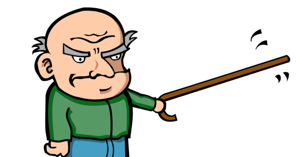

Crawlino - Crawling by rules definition
=======================================

*Crawlino: the new concept of crawlers. More powerful, easier and NOT only for web-scrapping*

+----------------+-------------------------------------------------------+
|Project site    | https://github.com/bbva/crawlino                      |
+----------------+-------------------------------------------------------+
|Issues          | https://github.com/bbva/crawlino/issues/              |
+----------------+-------------------------------------------------------+
|Documentation   | https://crawlino.readthedocs.org/                     |
+----------------+-------------------------------------------------------+
|Authors         | Daniel Garcia (cr0hn)                                 |
+----------------+-------------------------------------------------------+
|Python versions | 3.6 or above                                          |
+----------------+-------------------------------------------------------+
|License         | Apache 2                                              |
+----------------+-------------------------------------------------------+

Documentation
=============

Go to documentation site: https://crawlino.readthedocs.org/

Contributing
============

Any collaboration is welcome!

There're many tasks to do.You can check the `Issues <https://github.com/bbva/crawlino/issues/>`_ and send us a Pull Request.

Also you can read the `TODO <https://github.com/bbva/crawlino/blob/master/TODO.md>`_ file.

License
=======

This project is distributed under `Apache 2 license <https://github.com/bbva/crawlino/blob/master/LICENSE>`_
